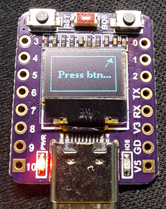
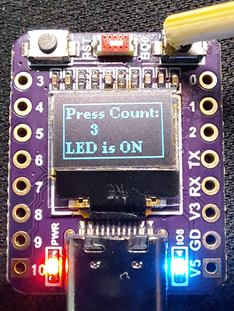
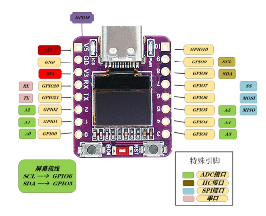

# ESP32-C3 with a 0.42-inch OLED screen develpment board Demo Project

## How it looks like

### Usefull info

#### Pin Notes

- GPIO8 has an inverted blue status LED.
- The BOOT button is wired to GPIO9.
